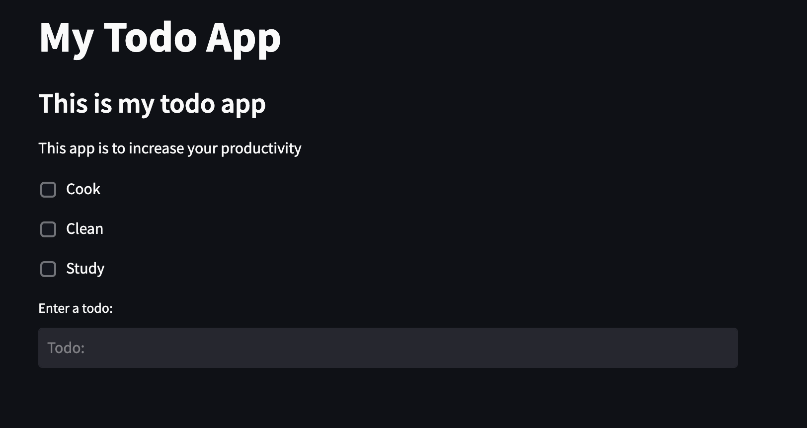

# Todo List Web Application

 

## <u>Table of Contents</u>

1. [Description](#Description)
2. [Installation](#Installation)
3. [Usage](#Usage)
4. [Contributing](#Contributing)
5. [Authors](#Authors)
6. [License](#License)

## Description

Todo List Web Application is a program that helps users keepy track of tasks in an easy to use and read application.
This application is a modification of a previous todo application, which was run on the command line, or via a
standalone gui application. The application allows users to create new items, modify or delete existing items in an
organized manner. The items are stored in a txt file, which updates along with the application. Unlike the previous GUI
application, this web app can be used on any browser, and subsequently any operating system.

### Dependencies

This application uses a third party library to build its user interface. It uses the streamlit library, and its
easy-to-use methods and features to seamlessly re-create the previous todo list GUI, but in a web application instead.

## Installation

This application does not have an installable option, but the source code can easily be cloned to your local machine by
running git clone <repo URL>. This will allow you to get the online repository code onto your local machine.

## Usage

To use this application, visit the application URL at https://charanvir-todo-web-app-webapp-cos6vt.streamlit.app/

Then start adding new items to the todo list, modify existing items, and mark items as complete. 

## Contributing

We are always looking to improve your application and code, so if you wish to contribute, please create a repository and
push all changes you make to it. Then email me at charanvir123@gmail.com, and I will try to get back to you after I have
reviewed the code.

## Authors

To view more projects visit my [GitHub](https://github.com/Charanvir) account.

Direct any additional questions you have regarding this application to charanvir123@gmail.com

# License

The following application is covered under the MIT License.